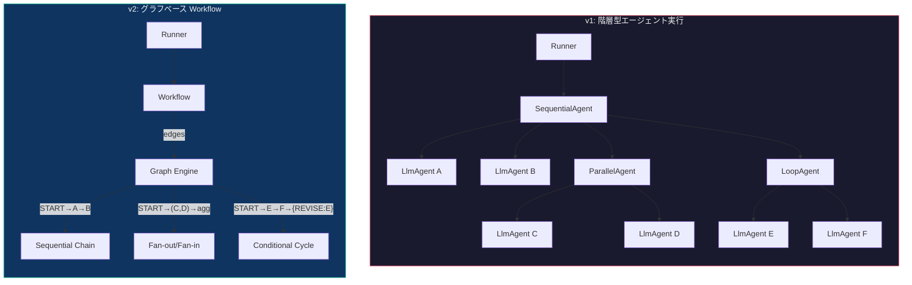
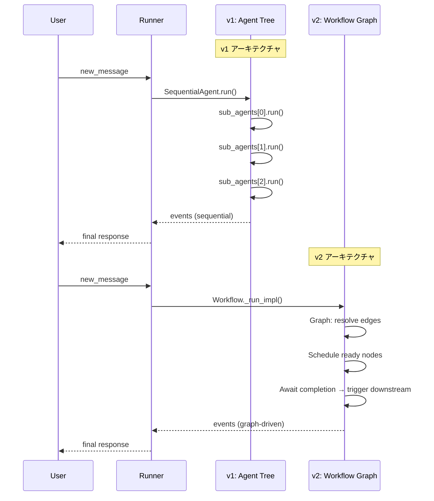
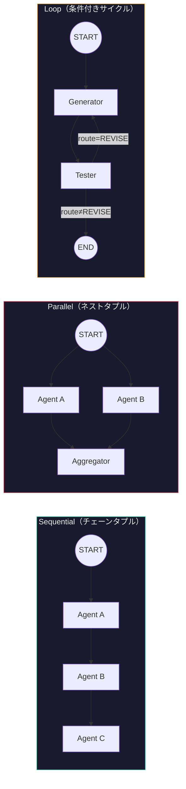
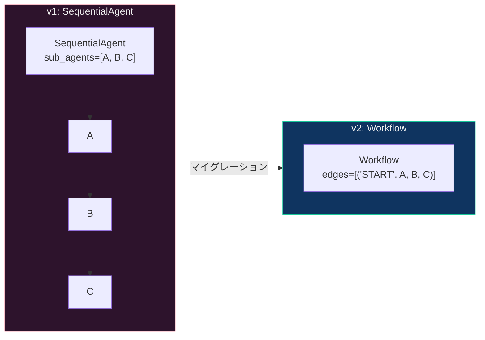
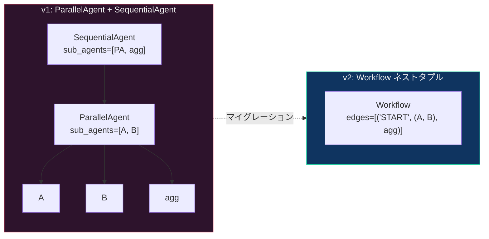
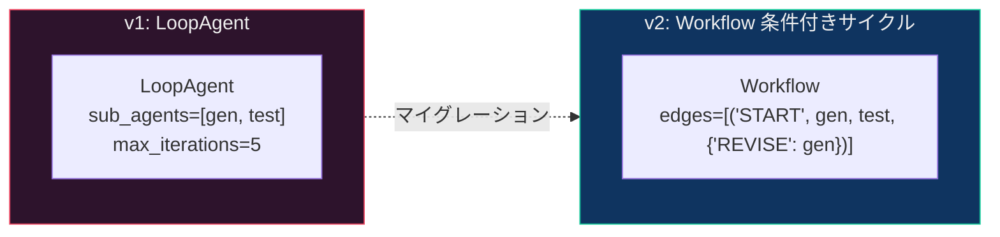
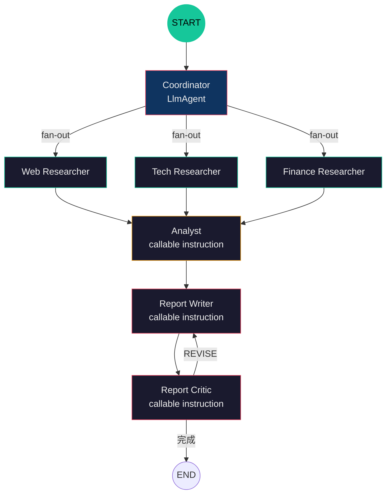
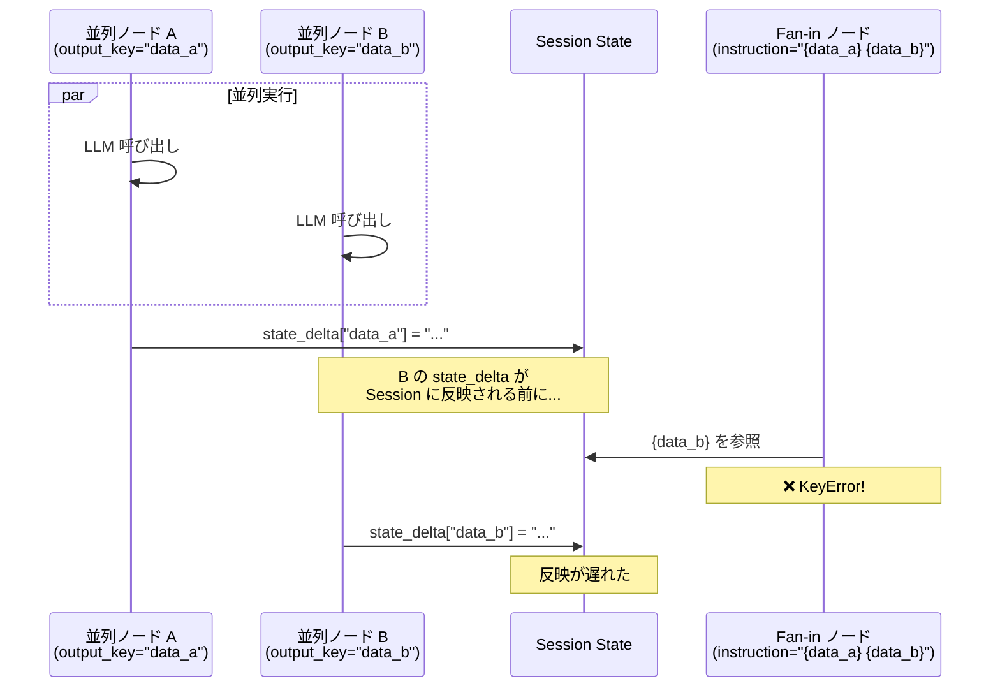

# Google ADK v1 → v2 マイグレーションガイド

> **対象バージョン**: google-adk `>=1.19.0` → `>=2.1.0`
> **調査日**: 2026-05-25
> **ステータス**: ✅ 移行完了・統合テスト全パス

---

## 目次

1. [エグゼクティブサマリー](#1-エグゼクティブサマリー)
2. [アーキテクチャ変更の全体像](#2-アーキテクチャ変更の全体像)
3. [API 互換性マトリックス](#3-api-互換性マトリックス)
4. [Workflow API リファレンス](#4-workflow-api-リファレンス)
5. [パターン別マイグレーション](#5-パターン別マイグレーション)
6. [依存バージョン制約](#6-依存バージョン制約)
7. [Breaking Changes & 注意事項](#7-breaking-changes--注意事項)
8. [セキュリティ（CVE-2026-4810）](#8-セキュリティcve-2026-4810)
9. [プロジェクト影響度サマリー](#9-プロジェクト影響度サマリー)
10. [テスト結果](#10-テスト結果)

---

## 1. エグゼクティブサマリー

ADK v2 の最大の変更は **グラフベース Workflow Runtime** の導入。
従来の `SequentialAgent` / `ParallelAgent` / `LoopAgent` による階層型エージェント実行が、
`Workflow` クラスの **edges（エッジ定義）** による宣言的なグラフ構造に置き換わった。

| 観点 | v1 | v2 |
|------|----|----|
| 実行モデル | 階層型エージェントツリー | **グラフベース Workflow** |
| Sequential | `SequentialAgent(sub_agents=[...])` | `Workflow(edges=[("START", a, b, c)])` |
| Parallel | `ParallelAgent(sub_agents=[...])` | `Workflow(edges=[("START", (a, b), agg)])` |
| Loop | `LoopAgent(sub_agents=[...])` | `Workflow(edges=[("START", a, b, {"REVISE": a})])` |
| 移行難易度 | — | **中**（LlmAgent/Runner/Session が互換） |

---

## 2. アーキテクチャ変更の全体像

### v1 → v2 アーキテクチャ比較



### データフロー比較



---

## 3. API 互換性マトリックス

### 3-1. 後方互換（v2 でそのまま使える）✅

| カテゴリ | API | import パス | 備考 |
|---------|-----|-----------|------|
| **エージェント** | `LlmAgent` | `from google.adk.agents import LlmAgent` | クラス名・引数とも変更なし |
| | `model` | `LlmAgent(model="...")` | デフォルト: `gemini-2.5-flash` |
| | `instruction` | `LlmAgent(instruction="...")` | `{variable_name}` プレースホルダーも健在 |
| | `output_key` | `LlmAgent(output_key="...")` | state スコープ (`user:`, `app:`, `temp:`) も同じ |
| | `sub_agents` | `LlmAgent(sub_agents=[...])` | LLM ルーティングで動的委譲 |
| | `description` | `LlmAgent(description="...")` | 変更なし |
| | `tools` | `LlmAgent(tools=[...])` | 関数ツールの自動 FunctionTool ラップも健在 |
| **実行** | `Runner` | `from google.adk.runners import Runner` | コンストラクタ拡張 (`app`, `node` 追加) |
| | `run_async()` | `runner.run_async(user_id, session_id, new_message)` | primary な非同期実行メソッド |
| | `InMemorySessionService` | `from google.adk.sessions import InMemorySessionService` | ローカル/テスト用 |
| **イベント** | `is_final_response()` | `event.is_final_response()` | 変更なし |
| | `content.parts` | `event.content.parts` | 変更なし |
| **ツール** | `google_search` | `from google.adk.tools import google_search` | 変更なし |
| | `code_execution` | `from google.adk.tools import code_execution` | 変更なし |
| | `ToolContext` | `from google.adk.tools import ToolContext` | 変更なし |
| **型** | `Content/Part` | `from google.genai import types` | google-genai パッケージ |
| **CLI** | `adk web` / `adk run` | — | 変更なし |

### 3-2. Deprecated（動作するが DeprecationWarning）⚠️

| API | import パス | v2 の代替 | 備考 |
|-----|-----------|---------|------|
| `SequentialAgent` | `from google.adk.agents import SequentialAgent` | `Workflow` チェーンタプル | `@deprecated` デコレータ付き |
| `ParallelAgent` | `from google.adk.agents import ParallelAgent` | `Workflow` ネストタプル | `@deprecated` デコレータ付き |
| `LoopAgent` | `from google.adk.agents import LoopAgent` | `Workflow` 条件付きサイクル | `@deprecated` デコレータ付き |
| `global_instruction` | `LlmAgent(global_instruction="...")` | `GlobalInstructionPlugin` | 将来バージョンで削除予定 |

### 3-3. 新規追加（v2 only）🆕

| API | import パス | 説明 |
|-----|-----------|------|
| `Agent` | `from google.adk import Agent` | `LlmAgent` のトップレベルエイリアス |
| `Workflow` | `from google.adk.workflow import Workflow` | **グラフベースワークフロー** |
| `Node` / `@node` | `from google.adk.workflow import Node, node` | 関数ノードデコレータ |
| `Edge` | `from google.adk.workflow import Edge` | 明示的なエッジ定義 |
| `JoinNode` | `from google.adk.workflow import JoinNode` | 複数ノード出力の結合 |
| `exit_loop` | `from google.adk.tools import exit_loop` | ループ終了用ツール |
| `App` | `from google.adk.apps.app import App` | アプリケーションコンテナ |
| Task API | — | Chat / Task / Single-Turn モード |
| `static_instruction` | `LlmAgent(static_instruction="...")` | コンテキストキャッシュ最適化 |
| 自動リトライ | フレームワーク組み込み | ツール例外の自動リトライ |
| HITL ネイティブ | フレームワーク組み込み | Human-in-the-Loop サポート |

---

## 4. Workflow API リファレンス

### 4-1. edges 構文



### 4-2. 構文例

| パターン | edges 構文 | 生成されるエッジ |
|---------|-----------|---------------|
| **Sequential** | `("START", a, b, c)` | `START→A`, `A→B`, `B→C` |
| **Parallel** | `("START", (a, b), agg)` | `START→A`, `START→B`, `A→agg`, `B→agg` |
| **Conditional** | `("START", router, {"X": hx, "Y": hy})` | `START→router`, `router→hx(route=X)`, `router→hy(route=Y)` |
| **Loop** | `("START", a, b, {"REVISE": a})` | `START→A`, `A→B`, `B→A(route=REVISE)` |

> ⚠️ **重要な制約**: Workflow は **無条件サイクル（unconditional cycle）を禁止**。
> `(b, a)` のような無条件ループバックは `Graph validation failed` エラー。
> 必ず **dict による条件付きエッジ** でサイクルを定義すること。

---

## 5. パターン別マイグレーション

### 5-1. Sequential → Workflow



**v1:**
```python
from google.adk.agents import LlmAgent, SequentialAgent

root_agent = SequentialAgent(
    name="etl_pipeline",
    sub_agents=[extract, transform, load],
)
```

**v2:**
```python
from google.adk.agents import LlmAgent
from google.adk.workflow import Workflow

root_agent = Workflow(
    name="etl_pipeline",
    edges=[("START", extract, transform, load)],
)
```

### 5-2. Parallel → Workflow (fan-out/fan-in)



**v1:**
```python
from google.adk.agents import LlmAgent, ParallelAgent, SequentialAgent

parallel = ParallelAgent(name="gather", sub_agents=[source_a, source_b])
root_agent = SequentialAgent(name="pipeline", sub_agents=[parallel, aggregator])
```

**v2:**
```python
from google.adk.agents import LlmAgent
from google.adk.workflow import Workflow

root_agent = Workflow(
    name="pipeline",
    edges=[("START", (source_a, source_b), aggregator)],
)
```

> ⚠️ **state_delta タイミング問題**: fan-in ノード（aggregator）の instruction で `{変数名}` テンプレートを使うと `KeyError` が発生する。instruction を **callable** にして `ReadonlyContext.state.get()` で安全に参照する必要がある。[詳細は §7-6 参照](#7-6-ネストタプルの-state_delta-タイミング問題)

### 5-3. Loop → Workflow (条件付きサイクル)



**v1:**
```python
from google.adk.agents import LlmAgent, LoopAgent

root_agent = LoopAgent(
    name="code_loop",
    sub_agents=[generator, tester],
    max_iterations=5,
)
```

**v2:**
```python
from google.adk.agents import LlmAgent
from google.adk.workflow import Workflow

# tester が "REVISE" を返すとループ継続、それ以外で終了
root_agent = Workflow(
    name="code_loop",
    edges=[("START", generator, tester, {"REVISE": generator})],
)
```

### 5-4. Coordinator / Hierarchical（変更なし）

LlmAgent の `sub_agents` によるルーティングは v2 でもそのまま動作。

```python
# v1 でも v2 でも同じ
root_agent = LlmAgent(
    name="coordinator",
    sub_agents=[order_handler, refund_handler, general_handler],
    instruction="ユーザーの意図に応じて適切なエージェントに委譲...",
)
```

### 5-5. Capstone（全パターン統合）



---

## 6. 依存バージョン制約

### v2 が要求する主要依存

| パッケージ | v1 での要件 | v2 での要件 | 変更 |
|-----------|-----------|-----------|------|
| `google-adk` | `>=1.19.0` | `>=2.1.0` | 🔴 メジャー更新 |
| `google-genai` | `>=1.52.0` | `>=1.72,<2` | 🟡 マイナー更新 |
| `fastapi` | — | `>=0.124.1,<1` | 🆕 新規依存 |
| `pydantic` | `>=2.4.0` (settings) | `>=2.12,<3` | 🟡 マイナー更新 |
| `httpx` | — | `>=0.27,<1` | 🟢 互換 |
| `uvicorn` | — | `>=0.34,<1` | 🆕 新規依存 (adk web) |
| `graphviz` | — | `>=0.20.2,<1` | 🆕 新規依存 (可視化) |
| `opentelemetry-api` | — | `>=1.36` | 🆕 新規依存 (テレメトリ) |
| `opentelemetry-sdk` | — | `>=1.36` | 🆕 新規依存 (テレメトリ) |

### pyproject.toml の変更

```diff
# pyproject.toml
dependencies = [
-    "google-adk>=1.19.0",
-    "google-genai>=1.52.0",
+    "google-adk>=2.1.0",
+    "google-genai>=1.72.0,<2",
]
```

---

## 7. Breaking Changes & 注意事項

### 7-1. Event スキーマ変更

Event に `node_info`, `output` フィールドが追加。カスタム DB スキーマを使用している場合は更新が必要。
`InMemorySessionService` 使用なら影響なし。

### 7-2. セッション互換性

v2 セッションは v1 (`<1.28`) の ADK では読めない。v2 統一なら問題なし。

### 7-3. session.events への手動追加は非推奨

`context.session.events` への手動追加はグラフエンジンの決定論性を壊す。

### 7-4. ツールの例外ハンドリング

v2 は自動リトライ機能が組み込まれているが、ツール内で広い `except Exception:` を使うと自動リトライが阻害される。例外キャッチは限定的にすること。

### 7-5. Workflow は BaseNode（BaseAgent ではない）

`Workflow` は `BaseAgent` のサブクラスではなく `BaseNode` のサブクラス。
そのため、`LlmAgent(sub_agents=[Workflow(...)])` は **ValidationError** になる。

```python
# ❌ これはエラー
root_agent = LlmAgent(sub_agents=[Workflow(...)])

# ✅ Coordinator を Workflow の edges 内に組み込む
root_agent = Workflow(edges=[
    ("START", coordinator_llm_agent, ...),
])
```

### 7-6. ネストタプルの state_delta タイミング問題

**最も重要な発見**。v2 Workflow のネストタプル（並列実行）では、fan-in ノードの instruction テンプレート `{変数名}` が `KeyError` になる場合がある。

#### 根本原因



#### 影響するパターン

| パターン | 問題の有無 | 理由 |
|---------|-----------|------|
| Sequential（チェーンタプル） | ✅ 問題なし | 直列実行で state_delta 反映が保証 |
| **Parallel（ネストタプル）** | ❌ **問題あり** | fan-in ノードの `{変数名}` が KeyError |
| Loop（条件付きサイクル） | ✅ 問題なし | 直列実行 |

#### 解決策: instruction を callable にする

```python
from google.adk.agents.readonly_context import ReadonlyContext

# ❌ Before: 文字列テンプレート（KeyError が発生）
synthesizer = LlmAgent(
    instruction="""
    {google_ai_news}
    {openai_news}
    """,
)

# ✅ After: callable instruction（安全に state 参照）
async def _build_instruction(ctx: ReadonlyContext) -> str:
    google_ai = ctx.state.get("google_ai_news", "（データなし）")
    openai = ctx.state.get("openai_news", "（データなし）")
    return f"""
    {google_ai}
    {openai}
    """

synthesizer = LlmAgent(
    instruction=_build_instruction,  # callable!
)
```

### 7-7. google.adk.workflows は存在しない

Web 上の情報で `from google.adk.workflows import WorkflowAgent` という記述があるが、
**ADK 2.1.0 には `google.adk.workflows` モジュールは存在しない**。

正しい import: `from google.adk.workflow import Workflow`

### 7-8. 無条件サイクルの禁止

`edges=[(agent_b, agent_a)]` のような無条件ループバックは
`Graph validation failed. Unconditional cycle detected` エラーになる。

```python
# ❌ 無条件サイクル（エラー）
edges=[("START", a, b, a)]

# ✅ 条件付きサイクル
edges=[("START", a, b, {"CONTINUE": a})]
```

---

## 8. セキュリティ（CVE-2026-4810）

| 項目 | 詳細 |
|------|------|
| **CVE** | CVE-2026-4810 |
| **深刻度** | **Critical** (CVSS 9.3〜10.0) |
| **脆弱性タイプ** | Code Injection + Missing Authentication (CWE-306) |
| **影響** | 未認証のリモート攻撃者が任意コード実行 (RCE) 可能 |
| **原因** | ADK Web UI のエンドポイントに認証がなく、悪意ある設定アップロードで任意コード実行 |
| **影響バージョン** | **1.7.0 〜 1.28.0**, 2.0.0a1 〜 2.0.0a2 |
| **修正バージョン** | 1.28.1 / 2.0.0a3 以降 |
| **影響範囲** | Cloud Run、GKE、ローカル ADK Web すべて |

> ⚠️ `google-adk>=1.19.0` の設定では、脆弱性のあるバージョンがインストールされ得る。
> **v2 (>=2.1.0) への移行は必須**。

---

## 9. プロジェクト影響度サマリー

### ファイル別影響度

| ファイル | 使用 deprecated API | 影響度 | 変更内容 |
|---------|-------------------|-------|---------| 
| `pyproject.toml` | — | 🔴 必須 | バージョン引き上げ |
| `shared/config.py` | なし | 🟢 なし | v2 互換 |
| `shared/demo_runner.py` | なし | 🟢 なし | Runner/Session は v2 で健在 |
| `p01_single_agent/agent.py` | なし | 🟢 なし | v2 完全互換 |
| `p02_react_pattern/agent.py` | なし | 🟢 なし | v2 完全互換 |
| `p03_sequential/agent.py` | `SequentialAgent` | 🔴 大 | → `Workflow` チェーンタプル |
| `p04_parallel/agent.py` | `ParallelAgent`, `SequentialAgent` | 🔴 大 | → `Workflow` ネストタプル + callable instruction |
| `p05_loop/agent.py` | `LoopAgent` | 🔴 大 | → `Workflow` 条件付きサイクル |
| `p06_review_critique/agent.py` | `LoopAgent` | 🔴 大 | → `Workflow` 条件付きサイクル |
| `p07_iterative_refinement/agent.py` | `LoopAgent` | 🔴 大 | → `Workflow` 条件付きサイクル |
| `p08_coordinator/agent.py` | なし | 🟢 なし | v2 完全互換 |
| `p09_hierarchical/agent.py` | なし | 🟢 なし | v2 完全互換 |
| `p10_swarm/agent.py` | `LoopAgent`, `SequentialAgent` | 🔴 大 | → `Workflow` |
| `p11_human_in_the_loop/agent.py` | 独自ワークフロー | 🟡 中 | → `Workflow` + HITL |
| `capstone/agent.py` | 全4クラス | 🔴 最大 | → `Workflow` 全面移行 + callable instruction |

### 影響ファイル数サマリー

| 影響度 | ファイル数 | 内容 |
|-------|----------|------|
| 🔴 大（コード書き直し） | **8** | 6 パターン + capstone + pyproject.toml |
| 🟡 中（軽微な修正） | **~20** | テスト・ドキュメント・スキル |
| 🟢 なし（互換） | **6** | 5 パターン + shared モジュール |

---

## 10. テスト結果

### Lv.1 ユニットテスト

```
50 passed in 1.20s ✅
```

### Lv.2 統合テスト（実 LLM / Vertex AI）

```
12 passed, 1 warning in 529.89s (0:08:49) ✅
```

| # | テスト | パターン | 結果 |
|---|--------|---------|------|
| 1 | TestSingleAgent | p01_single_agent | ✅ PASS |
| 2 | TestReAct | p02_react_pattern | ✅ PASS |
| 3 | TestSequential | p03_sequential | ✅ PASS |
| 4 | TestParallel | p04_parallel | ✅ PASS |
| 5 | TestLoop | p05_loop | ✅ PASS |
| 6 | TestReviewCritique | p06_review_critique | ✅ PASS |
| 7 | TestIterativeRefinement | p07_iterative_refinement | ✅ PASS |
| 8 | TestCoordinator (order) | p08_coordinator | ✅ PASS |
| 9 | TestCoordinator (refund) | p08_coordinator | ✅ PASS |
| 10 | TestHierarchical | p09_hierarchical | ✅ PASS |
| 11 | TestSwarm | p10_swarm | ✅ PASS |
| 12 | TestCapstone | capstone | ✅ PASS |

---

## 付録: 実装時に発見した追加差分

| # | 発見 | 影響 | 対応 |
|---|------|------|------|
| 1 | `google.adk.workflows` モジュール不存在 | import エラー | `google.adk.workflow` を使用 |
| 2 | 無条件サイクルの禁止 | Graph validation エラー | dict 条件付きエッジを使用 |
| 3 | チェーンタプル構文の発見 | より簡潔な記述が可能 | 全パターンで採用 |
| 4 | ネストタプル fan-out/fan-in | 並列実行の簡潔な表現 | p04_parallel, capstone で採用 |
| 5 | `uv sync` の staging index 問題 | pip install 失敗 | `--index-url` で回避 |
| 6 | `Workflow` は `BaseNode` | `sub_agents` に入れられない | Coordinator を edges 内に組み込み |
| 7 | state_delta タイミング問題 | fan-in ノードで KeyError | callable instruction で解決 |
