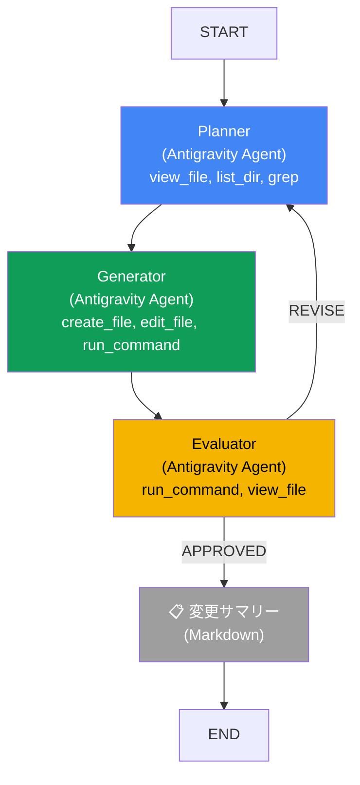

# Agentic Pipeline

> **BaseAgent (PGEOrchestrator) + Antigravity Agent** による Planner-Generator-Evaluator 3者間自律コード実装パイプライン

## 概要

BaseAgent（PGEOrchestrator）でループ制御を行い、各ノードの内部処理を Antigravity Agent（自律エージェント）に委任するハイブリッドパターン。

> [!NOTE]
> ADK Workflow の条件付きエッジは ADK v2 に実装されているが、PGE パイプラインの複雑なループ制御（スコア履歴管理、リグレッションガード、改善停滞検出、ブロッカー判定など）には不十分だったため、BaseAgent を採用した。

非エンジニアが「○○を実装して」とプロンプトを投げるだけで、品質スコア 80+ のコードを自律生成する。
**Python / TypeScript / Go / Rust / Java 等のバックエンド、Next.js / React 等のフロントエンド、Docker / Terraform 等のインフラまで技術スタック非依存で対応。**

### 既存パターンとの関係

```
agentic_pipeline = Sequential(03) + Review&Critique(06) + Hierarchical(09)
```

| 既存パターン | 取り入れる要素 |
|------------|------------|
| **03 Sequential** | P → G → E の直列パイプライン |
| **06 Review & Critique** | E → P フィードバックループ |
| **09 Hierarchical** | BaseAgent が Antigravity Agent を管理 |

## アーキテクチャ



### レイヤー構造

```
PGEOrchestrator (BaseAgent — ループ制御 + Markdown 出力)
├── run_planner_agent()   → Antigravity Agent (設計方針策定)
├── run_generator_agent() → Antigravity Agent (コード実装)
└── run_evaluator_agent() → Antigravity Agent (品質評価)
```

### アプローチ: Antigravity Agent に自律性を委任

各 Antigravity Agent はビルトインツールを使って**自律的に行動**する。
PGEOrchestrator は交通整理（P→G→E→REVISE）とスコア管理のみ。

| エージェント | 役割 | ツール | コマンド実行 |
|------------|------|--------|------------|
| **Planner** | ソフトウェアアーキテクト + UI/UX 設計 | `view_file`, `list_dir`, `grep_search` | ❌ 不可 |
| **Generator** | ソフトウェアエンジニア | `create_file`, `edit_file`, `view_file`, `run_command` | ✅ セルフチェック用 |
| **Evaluator** | QA エンジニア + セキュリティアナリスト | `run_command`, `view_file`, `list_dir`, `grep_search` | ✅ テスト・ビルド検証 |

> [!TIP]
> Generator の `run_command` は **セルフチェック用** に許可されている。
> コード生成後に `ruff check` → 修正 → `pytest` → 修正 → `npm run build` → 修正
> というサイクルを Generator 自身が自律的に回し、Evaluator に渡す前の品質を底上げする。

## 評価基準

### 7 ステップ必須検証（Evaluator）

| Step | 検証内容 | 観点 |
|------|---------|------|
| 1 | `ls -R` でファイル完全性チェック | 設計方針通りのファイルが存在するか |
| 2 | 依存関係の解決確認 | import エラー、未インストールパッケージ |
| 3 | **ビルド / 起動テスト** | `docker build`, `npm run build`, `go build` 等 |
| 4 | テスト実行 | `pytest`, `npm test`, `go test` 等 |
| 5 | コード品質チェック | `ruff check`, `eslint`, `golangci-lint` 等 |
| 6 | **UI/UX 品質チェック** | CSS 存在確認、デザイントークン、レスポンシブ |
| 7 | 設計品質レビュー | モジュール分離、命名規則、アーキテクチャ整合性 |

### スコアリング（0-100）

| カテゴリ | 配点 | CRITICAL となるケース |
|---------|------|--------------------|
| 実行可能性 | 25 | ビルド失敗、import エラー |
| テスト合格率 | 20 | — |
| コード品質 | 20 | — |
| UI/UX 品質 | 15 | CSS ファイルなし（フロントエンド案件時） |
| 設計品質 | 20 | ファイル不足、構造不整合 |

### REVISE 条件（6段階、優先度順）

```
1. iteration >= max_iterations       → 強制 APPROVED（最大反復到達）
2. CRITICAL/HIGH ブロッカー残存      → 強制 REVISE（スコアに関わらず修正）
3. リグレッション（前回比スコア低下）  → 強制 REVISE
4. score < approval_threshold かつ
   LLM が APPROVED                  → 強制 REVISE
5. 改善停滞（改善幅 < min_improvement）→ APPROVED（条件付き承認）
6. LLM verdict をそのまま使用
```

### 設定可能なパラメータ

| パラメータ | デフォルト | 説明 |
|-----------|----------|------|
| `approval_threshold` | 80 | 承認閾値（0-100） |
| `max_loop_iterations` | 5 | 最大反復回数 |
| `min_improvement` | 5 | 改善停滞と判定する最低改善幅 |

## コマンド許可リスト

Generator / Evaluator が `run_command` で実行可能なコマンド:

| カテゴリ | コマンド |
|---------|--------|
| ファイル操作 | `ls`, `cat`, `head`, `tail`, `find`, `tree`, `grep` 等 |
| Python | `python`, `pip`, `pytest`, `ruff` |
| Node.js | `node`, `npm`, `npx`, `yarn`, `pnpm`, `tsx`, `tsc` |
| Go / Rust / Java | `go`, `cargo`, `javac`, `mvn`, `gradle` |
| コンテナ | `docker`, `podman`, `docker-compose`, `podman-compose` |
| IaC | `terraform`, `tofu`, `kubectl`, `helm` |
| ビルド | `make`, `cmake` |
| その他 | `git`, `curl`, `jq`, `bash` 等 |

> [!WARNING]
> 以下のコマンドは **ブロック** されます: `rm`, `rmdir`, `--fix`, `--fix-unsafe`, `autofix`, `format`, `fmt`
> Evaluator がコードを書き換えることを防止するためです。

## 出力フォーマット

PGE ループの進捗は **Markdown 形式** で出力され、`adk web`（ブラウザ）と `adk run`（ターミナル）の両方で正しく表示されます。

```
[Iteration 1] Planner を起動します...

### 📐 Planner 完了
**📋 設計方針:** クリーンアーキテクチャ...
**📦 モジュール一覧 (7 files):**
- `domain/models.py`
- `infrastructure/repository.py`
...

[Iteration 1] Generator を起動します...

### 🔨 Generator 完了 — 7 files 作成
**📄 作成ファイル:**
- `/output/domain/models.py`
...

[Iteration 1] Evaluator を起動します...

### [Iteration 1] ✅ APPROVED
score=85. pytest 20/20 passed, ruff 0 errors...

---

### 📋 変更サマリー
**新規:**
- `domain/models.py` — ドメインモデル定義
- `tests/test_models.py` — ユニットテスト
...

### 📁 出力ディレクトリ: `/path/to/output`
```
├── ✨ NEW domain/models.py  (45 lines, 1,234 bytes)
├── ✨ NEW tests/test_models.py  (78 lines, 2,456 bytes)
└── 📝 MOD README.md  (30 lines, 890 bytes)
```

> **合計:** 2 新規, 1 変更, 0 削除 (3 files, 153 lines)
```

## セットアップ

### 前提条件

- Python 3.12+
- `google-adk` (ADK v2) + `google-antigravity` (Antigravity SDK)
- `GEMINI_API_KEY`（Antigravity local harness に必須）

### インストール

```bash
pip install google-adk google-antigravity
```

## 実行

### adk run（ターミナル対話モード）

```bash
# 新規プロジェクト（デフォルト出力先: output/）
adk run patterns/agentic_pipeline

# ワンショット実行
adk run patterns/agentic_pipeline "Python で TODO アプリを作って"

# 既存プロジェクトの改修
adk run patterns/agentic_pipeline \
  --state '{"output_dir": "/path/to/project"}' \
  "認証機能を追加して"
```

### adk web（ブラウザ UI）

```bash
adk web patterns/agentic_pipeline
```

> [!TIP]
> `state["output_dir"]` を指定することで、任意のディレクトリを対象にできます。
> 未指定の場合は `patterns/agentic_pipeline/output/` がデフォルト出力先です。

### デモスクリプト

```bash
python patterns/agentic_pipeline/demo.py
```

## ファイル構成

```
patterns/agentic_pipeline/
├── __init__.py    # sys.path 設定 + Antigravity SDK ログフィルタ
├── agent.py       # PGEOrchestrator (BaseAgent) — ループ制御・Markdown 出力
├── tools.py       # Antigravity Agent ラッパー（コマンドポリシー・ワークスペース設定）
├── schemas.py     # Pydantic スキーマ（PlanOutput, ArtifactOutput, EvaluationOutput 等）
├── prompts.py     # 各エージェントのシステムプロンプト（技術スタック非依存）
├── demo.py        # デモ実行スクリプト
├── output/        # 生成コードの出力先（.gitignore 対象）
└── README.md      # このファイル
```

### スキーマ一覧

| スキーマ | 用途 | 主要フィールド |
|---------|------|--------------|
| `PlanOutput` | Planner の出力 | `architecture`, `modules`, `test_strategy`, `directory_structure` |
| `ArtifactOutput` | Generator の出力 | `files_created`, `summary` |
| `EvaluationOutput` | Evaluator の出力 | `verdict`, `score`, `issues`, `summary`, `execution_result` |
| `Issue` | 評価で見つかった問題 | `severity`, `category`, `description`, `file`, `line`, `suggestion` |
| `Severity` | 問題の深刻度 | `CRITICAL`, `HIGH`, `MEDIUM`, `LOW` |

## 設計上の工夫

### ログフィルタ（`__init__.py`）

Antigravity SDK が root logger に出力する大量の WebSocket ログ（`RAW WS MSG` 等）を抑制する `_QuietAntigravityFilter` を適用。ログファイルの 90%+ のノイズを除去し、PGE 関連のログのみが残る。

### Stale Session 対策（`agent.py`）

PGE ループの中間データ（`plan`, `artifact`, `evaluator_feedback`）を `ctx.session.state` ではなくローカル dict に保持。これにより、SQLite セッションサービスの `update_time` 不整合（stale session エラー）を回避。

### 差分修正モード（`tools.py`）

2 回目以降の反復では、既存ファイルを検出して Generator に「差分修正モード」を指示。全面的な書き直しを禁止し、Evaluator の指摘点のみを修正する効率的なループを実現。

### フロントエンド品質保証（`prompts.py`）

- **Planner**: UI/UX 設計方針（デザインシステム、レイアウト戦略、コンポーネント設計）の策定を必須化
- **Generator**: CSS/スタイリング実装を必須化。アンチパターン（CSS なし、デフォルトフォント放置等）を明示
- **Evaluator**: UI/UX 品質チェック（Step 6）で CSS 未作成 = CRITICAL 判定

## 06 Review & Critique との違い

| 軸 | 06 Review & Critique | Agentic Pipeline |
|----|---------------------|-----------------|
| **ループ構造** | 2者間（G↔C） | **3者間（P→G→E→P）** |
| **戻り先** | Generator | **Planner（再設計）** |
| **各ノードの能力** | 1回の LLM 呼び出し | **自律ループ（推論+コード実行+検証）** |
| **ツール実行** | なし | **あり（pytest, ruff, docker, npm 等 30+）** |
| **品質保証** | テキスト評価 | **ツールによる定量評価（5軸スコアリング）** |
| **ブロッカー検出** | なし | **CRITICAL/HIGH 課題で強制 REVISE** |
| **対応技術** | 特定言語 | **技術スタック非依存** |
| **フロントエンド** | 非対応 | **CSS/UI/UX 品質チェック込み** |
| **出力形式** | テキスト | **Markdown（adk web 対応）** |
