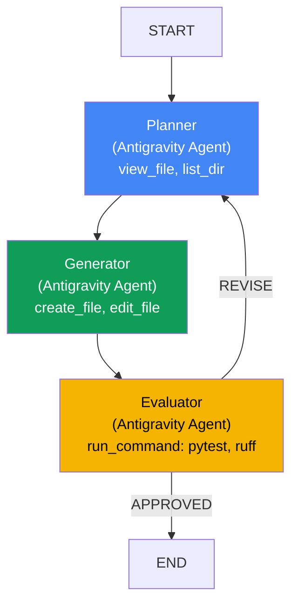

# Agentic Pipeline

> **BaseAgent (PGEOrchestrator) + Antigravity Agent** による Planner-Generator-Evaluator 3者間自律コード実装パイプライン

## 概要

BaseAgent（PGEOrchestrator）でループ制御を行い、各ノードの内部処理を Antigravity Agent（自律エージェント）に委任するハイブリッドパターン。

> [!NOTE]
> ADK Workflow の条件付きエッジは ADK v2 に実装されているが、PGE パイプラインの複雑なループ制御（スコア履歴管理、リグレッションガード、改善停滞検出、ブロッカー判定など）には不十分だったため、BaseAgent を採用した。

非エンジニアが「○○を実装して」とプロンプトを投げるだけで、品質スコア 80+ のコードを自律生成する。

### 既存パターンとの関係

```
agentic_pipeline = Sequential(03) + Review&Critique(06) + Hierarchical(09)
```

| 既存パターン | 取り入れる要素 |
|------------|------------|
| **03 Sequential** | P → G → E の直列パイプライン |
| **06 Review & Critique** | E → P フィードバックループ |
| **09 Hierarchical** | BaseAgent が Antigravity Agent を管理 |

## アーキテクチャ



### レイヤー構造

```
PGEOrchestrator (BaseAgent — ループ制御)
├── run_planner_agent()   → Antigravity Agent
├── run_generator_agent() → Antigravity Agent
└── run_evaluator_agent() → Antigravity Agent
```

### アプローチ: Antigravity Agent に自律性を委任

各 Antigravity Agent はビルトインツールを使って**自律的に行動**する。
PGEOrchestrator は交通整理（P→G→E→REVISE）とスコア管理のみ。

| エージェント | 役割 | ビルトインツール |
|------------|------|----------------|
| **Planner** | ソフトウェアアーキテクト | `view_file`, `list_dir`, `search_dir` |
| **Generator** | ソフトウェアエンジニア | `create_file`, `edit_file`, `view_file`, `run_command` |
| **Evaluator** | QA エンジニア | `run_command`（pytest, ruff のみ）, `view_file` |

> [!TIP]
> Generator の `run_command` は **セルフチェック用** に許可されている（`allow_commands=True`）。
> コード生成後に `ruff check` → 修正 → `pytest` → 修正 → submit というサイクルを
> Generator 自身が自律的に回すことで、Evaluator に渡す前の品質を底上げする。

## REVISE 条件（6段階、優先度順）

```
1. iteration >= max_iterations   → 強制 APPROVED（最大反復到達）
2. CRITICAL/HIGH ブロッカー残存  → 強制 REVISE（スコアに関わらず修正）
3. リグレッション（前回比スコア低下）→ 強制 REVISE
4. score < approval_threshold かつ LLM が APPROVED → 強制 REVISE
5. 改善停滞（改善幅 < min_improvement）→ APPROVED（条件付き承認）
6. LLM verdict をそのまま使用
```

### 評価基準（0-100）

| 軸 | 配点 | 評価方法 |
|----|------|---------|
| テスト合格率 | 35 | pytest 実行結果 |
| コード品質 | 25 | ruff エラー・警告数 |
| 設計品質 | 20 | モジュール分離、命名規則 |
| テストカバレッジ | 20 | テストの網羅性 |

### 設定可能なパラメータ

| パラメータ | デフォルト | 説明 |
|-----------|----------|------|
| `approval_threshold` | 80 | 承認閾値（0-100） |
| `max_loop_iterations` | 5 | 最大反復回数 |
| `min_improvement` | 5 | 改善停滞と判定する最低改善幅 |

## セットアップ

### 前提条件

- Python 3.12+
- GEMINI_API_KEY（Antigravity local harness に必須）
- `.env` に設定済み

### インストール

```bash
pip install google-antigravity
```

## 実行

```bash
python patterns/agentic_pipeline/demo.py
```

### dynamic output_dir

`state["output_dir"]` を指定することで、任意のディレクトリを対象にできる。
未指定の場合は `patterns/agentic_pipeline/output/` がデフォルト。

```bash
# 新規プロジェクト（デフォルト出力先）
adk run patterns/agentic_pipeline "Python で TODO アプリを作って"

# 既存プロジェクトの改修
adk run patterns/agentic_pipeline \
  --state '{"output_dir": "/path/to/project"}' \
  "認証機能を追加して"
```

## ファイル構成

```
patterns/agentic_pipeline/
├── agent.py       # PGEOrchestrator (BaseAgent) — PGE ループ制御
├── tools.py       # Antigravity Agent ラッパー（policies, workspaces 設定）
├── schemas.py     # Pydantic スキーマ（Severity, Issue, PlanOutput 等）
├── prompts.py     # 各エージェントの system_instructions
├── demo.py        # デモ実行スクリプト
├── output/        # 生成コードの出力先（.gitignore 対象）
└── README.md      # このファイル
```

## 06 Review & Critique との違い

| 軸 | 06 Review & Critique | Agentic Pipeline |
|----|---------------------|-----------------|
| **ループ構造** | 2者間（G↔C） | **3者間（P→G→E→P）** |
| **戻り先** | Generator | **Planner（再設計）** |
| **各ノードの能力** | 1回の LLM 呼び出し | **自律ループ（推論+コード実行+検証）** |
| **ツール実行** | なし | **あり（pytest, ruff）** |
| **品質保証** | テキスト評価 | **ツールによる定量評価** |
| **ブロッカー検出** | なし | **Critical/High 課題で強制 REVISE** |
